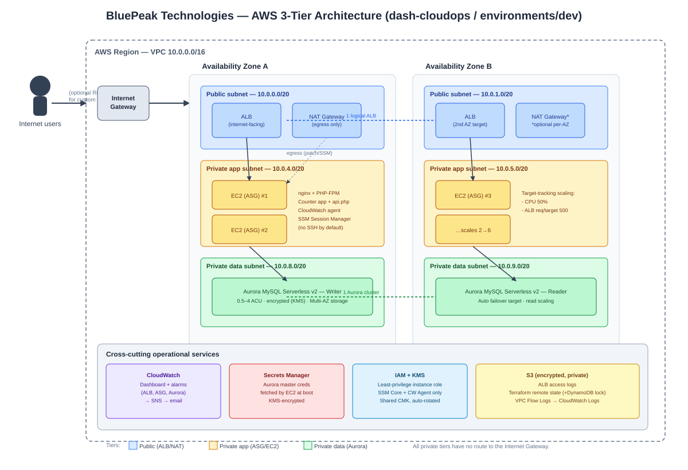

# Architecture Document

## 1. Scenario recap

BluePeak Technologies (finance) is moving a web application from on-premises to AWS.
Requirements: private 3-tier network, internet-facing app, managed HA/scalable database,
auto-scaling for fluctuating business-hours load, and a monitoring plan. This document
explains what was built and why.

*(The `.svg` above is a hand-built vector diagram; it opens and is fully editable in
draw.io / diagrams.net via File → Import. A source `.drawio` isn't required for import —
draw.io reads plain SVG directly.)*

## 2. Network design

| Tier | Subnets | Routing | Contains |
|---|---|---|---|
| Public | 2 (one per AZ), `/20` | Route to Internet Gateway | ALB, NAT Gateway(s) |
| Private-app | 2 (one per AZ), `/20` | Route to NAT Gateway (egress only) | EC2 instances (Auto Scaling Group) |
| Private-data | 2 (one per AZ), `/20` | No route to IGW or NAT — fully isolated except intra-VPC | Aurora MySQL cluster |

**Decisions / rationale**

- **Three explicit tiers, one subnet pair each** — matches the "3-tier application design"
  requirement literally, and keeps blast radius / security-group scoping unambiguous
  (public → app → data, one-way).
- **2 AZs by default, configurable to 3** (`az_count` variable) — 2 AZs is the practical
  minimum for "high availability" (ALB, ASG, and Aurora all need ≥2 AZs to tolerate a
  single AZ failure); 3 is offered for environments with a stricter SLA.
- **NAT Gateway strategy is a variable** (`single_nat_gateway`): one shared NAT (cheaper,
  ~$32/mo + data processing, but a single point of failure for *outbound* app-tier
  traffic only — inbound availability is unaffected) vs. one per AZ (true HA egress,
  ~2x NAT cost). Defaults to single-NAT for the dev environment; documented as the first
  toggle to flip for production.
- **Data tier has zero internet route** — not "restricted", but structurally absent. This
  is a common finance-sector control: even a misconfigured security group can't expose the
  database to the internet because there is no path out of the subnet.
- **VPC Flow Logs** enabled by default to CloudWatch Logs for network-level audit/forensics
  — relevant for a regulated (finance) workload.

## 3. Compute / application tier

- **EC2 + Auto Scaling Group behind an ALB**, not ECS/EKS/Lambda. Rationale: the assignment
  describes a classic "3-tier VM-based" migration, which is exactly what most on-prem
  finance workloads look like on day one of a cloud migration — this maps directly to
  that mental model and is the fastest thing for an ops team used to VMs to reason about
  and operate. **Documented as a first-class future iteration**: once the app is
  containerized, migrating the ASG module to ECS Fargate (or EKS) is a drop-in swap behind
  the same ALB/target-group, with no changes to network, security, or database tiers.
- **Launch Template + ASG**, `min=2 / desired=2 / max=6` (all variables). Minimum of 2
  guarantees the app survives a single-AZ failure with zero manual intervention.
- **Dual target-tracking scaling policies** — average CPU (50%) *and* ALB requests-per-target
  (500). Business-hours traffic is request-driven, not always CPU-bound (e.g. a slow
  downstream DB call ties up a worker without spiking CPU) — tracking both metrics means
  the ASG reacts to whichever constraint binds first.
- **Instance refresh** (rolling, 90% min-healthy) on the ASG means a new AMI or user-data
  change rolls out gradually with automatic health-check-gated replacement — no
  manually re-launching instances during a deploy.
- **IMDSv2 enforced**, **EBS encrypted with the shared CMK**, **detailed (1-min) monitoring**
  enabled on every instance.
- **SSM Session Manager is the default access path** (`enable_ssh = false`); the instance
  role only carries `AmazonSSMManagedInstanceCore` + `CloudWatchAgentServerPolicy` +
  a scoped Secrets Manager read policy — no broad IAM permissions, no SSH keys to manage
  or leak. A break-glass SSH toggle exists (`enable_ssh` + `allowed_ssh_cidrs`) but is off
  by default.

## 4. Database tier

- **Amazon Aurora MySQL, Serverless v2, provisioned engine mode**, writer + 1 reader by
  default (`reader_count` variable, set to 0 for a lower-cost dev sandbox or 2+ for a
  stricter SLA).
- **Why Aurora Serverless v2 over standard RDS**: the traffic pattern described
  ("fluctuates during business hours") is exactly Serverless v2's target case — it scales
  compute capacity (ACUs) up/down in fine-grained increments in seconds without a failover
  event, whereas standard RDS instance-class changes require either downtime or a
  reader-promotion dance. Aurora storage is also automatically distributed and replicated
  across 3 AZs regardless of instance count, and the separate reader instance adds a
  second, independent failover target — satisfying "managed service with HA and
  scalability characteristics" on both axes (storage HA is automatic; compute HA and
  read-scaling come from the reader).
- **Credentials in Secrets Manager**, not in Terraform state as plaintext outputs, not
  baked into the AMI or user-data — the app instance fetches the secret at boot via its
  IAM role and the AWS CLI. `random_password` generates the master password; Terraform is
  told to `ignore_changes` on it going forward so an out-of-band rotation (e.g. via
  Secrets Manager's native rotation Lambda, a natural next step) doesn't fight with `apply`.
- **Storage encrypted with the shared CMK**, **Performance Insights enabled**, **audit /
  error / slowquery logs exported to CloudWatch Logs**, **deletion protection on by
  default** (disabled only in the dev tfvars for easy teardown), **7-day backup retention**
  with a defined backup/maintenance window.
- **Security group only allows the DB port from the app-tier security group** — not a CIDR
  range, so it stays correct automatically as instances scale in/out.

## 5. Load balancing & TLS

- Internet-facing **Application Load Balancer** across both public subnets, HTTP health
  checks against a dedicated `/healthz.php` endpoint (separate from the app's DB-touching
  logic, so a transient DB blip doesn't tank the entire fleet's health checks).
- **HTTPS is fully wired but off by default** (`enable_https` + `acm_certificate_arn`)
  because no domain name was provided as part of the assignment — enabling it is a
  2-variable change (see DEPLOYMENT.md), at which point HTTP automatically 301-redirects
  to HTTPS with `ELBSecurityPolicy-TLS13-1-2-2021-06`.
- **Deregistration delay (30s)** so in-flight requests complete before an instance is
  removed during scale-in or a deploy.
- **ALB access logs to a dedicated, encrypted, non-public S3 bucket** with a 90-day
  lifecycle expiration.

## 6. The application

The assignment's GfG Increment/Decrement Counter is, as published, a purely client-side
demo (a JS variable incremented/decremented in the browser, never sent anywhere). Serving
only that would leave the database tier structurally present but functionally untouched,
which undersells "3-tier" in practice. So the deployed app keeps the exact same
increment/decrement UI/UX, and adds one small, real data-tier round trip: each click also
calls a PHP endpoint (`api.php`) that increments and reads back a shared
"total interactions across all users" counter stored in Aurora. This is intentionally
the smallest possible change that makes all three tiers do real work end-to-end, without
turning the demo into a different app. `nginx + PHP-FPM` was chosen over a heavier
framework because the entire task is three files and doesn't warrant a runtime/framework
decision of its own.

## 7. Security summary

| Control | Implementation |
|---|---|
| Network segmentation | 3-tier subnets, layered SGs (internet→ALB→app→DB), DB tier has no internet route |
| Encryption at rest | KMS CMK (auto-rotated) for EBS, Aurora storage, Secrets Manager, CloudWatch Logs |
| Encryption in transit | ALB→TLS1.3-capable (optional today, on by variable), intra-VPC traffic only for DB |
| Least privilege IAM | Instance role scoped to SSM, CW agent, and one named secret ARN — nothing else |
| Credential management | Secrets Manager, fetched at runtime, never in code/state/AMI |
| No SSH by default | SSM Session Manager; IMDSv2 enforced (blocks legacy SSRF-to-metadata paths) |
| Audit trail | VPC Flow Logs, Aurora audit/error/slowquery logs, ALB access logs — all centralized |
| Public exposure | Only the ALB (and NAT EIPs for egress) has a public IP; everything else private |
| State security | S3 backend versioned + encrypted + public-access-blocked, DynamoDB state locking |

## 8. High availability & scalability summary

| Layer | HA mechanism | Scaling mechanism |
|---|---|---|
| Network | 2 (or 3) AZs, subnet per tier per AZ | N/A |
| Compute | ASG spans all app subnets/AZs, min=2 | Target-tracking on CPU + ALB req/target, 2→6 instances |
| Load balancer | ALB is inherently multi-AZ/managed | Scales automatically (AWS-managed) |
| Database | Aurora storage replicated across 3 AZs; writer + reader give a 2nd failover target | Serverless v2 auto-scales 0.5–4 ACU (variable); add readers for read-scaling |

## 9. Monitoring & operational metrics

A CloudWatch dashboard (`modules/monitoring`) and SNS-backed alarms cover:

**Already implemented as alarms:**
- ALB 5xx count (backend errors), ALB p90/avg target response time (latency), ALB
  unhealthy host count (availability), ASG average CPU (capacity headroom), Aurora CPU,
  Aurora connection count (saturation/leak detection).

**Recommended additional metrics for BluePeak's operators** (to wire up once real usage
data exists — noted here since the assignment specifically asks what should be
monitored):

*Operational / reliability:*
- **Availability / uptime** against the internal SLA (synthetic canary hitting `/` and
  `/api.php` from outside the VPC, e.g. CloudWatch Synthetics or Route 53 health checks)
- **Error budget burn rate** (5xx rate over rolling windows, not just raw count)
- **MTTD / MTTR** for incidents (derived from alarm-to-resolution timestamps, tracked outside AWS)
- **Deployment frequency & change-failure rate** (DORA metrics, once CI/CD exists)
- **Aurora replica lag** (once >1 reader; important once reads are actually split)
- **NAT Gateway bandwidth/port-allocation errors** (early warning before egress starts failing)

*Customer / business:*
- **Time-to-first-byte / page load time** from the user's perspective (RUM, not just ALB-side)
- **Conversion / completion rate** for whatever the counter/app models in production (e.g.
  "successful transactions" instead of "button clicks")
- **Customer-visible error rate** (4xx from real user input vs. 5xx from the platform — track separately)
- **Cost per transaction** (tie Cost Explorer/Cost & Usage Report data to request volume —
  relevant since this is a finance company and unit economics likely matter to the business)
- **Session/engagement metrics** if this is customer-facing (bounce rate, session length)

## 10. Cost optimization notes

- Aurora Serverless v2 scales to 0.5 ACU at idle rather than paying for a fixed always-on
  instance size sized for peak.
- `t3.micro` default instance type (burstable, cheap) — sized appropriately for a demo;
  swap to `m6i`/`m7i` family for sustained production CPU needs (variable, one line to change).
- Single-NAT-Gateway option for non-prod environments cuts NAT cost in half at the expense
  of AZ-independent egress (explicitly called out as a prod-vs-dev tradeoff, not hidden).
- S3 lifecycle rule expires ALB logs after 90 days instead of accumulating indefinitely.
- `db_reader_count = 0` is available for a throwaway dev sandbox to avoid paying for a
  second Aurora compute instance when HA isn't being tested.

## 11. Assumptions & constraints

- Single AWS account, single region deployment. Multi-region DR (e.g. Aurora Global
  Database, Route 53 failover routing) is out of scope but is a natural next step once an
  RPO/RTO target is defined by the business.
- No domain name or ACM certificate was provided, so HTTPS ships disabled-by-default but
  fully implemented behind a variable, per §5.
- CI/CD (e.g. a pipeline that runs `terraform plan/apply` on merge) is out of scope for
  this take-home; deployment is manual per docs/DEPLOYMENT.md. In a real engagement this
  would be the very next thing built (GitHub Actions / CodePipeline with an OIDC role,
  `plan` on PR + `apply` on merge to `main`, environment promotion dev→staging→prod).
- Terraform Test / `checkov`/`tfsec` static scanning were not wired into a pipeline here
  for the same reason (no CI target exists yet); running `checkov -d .` locally before
  every `apply` is recommended in the interim and is called out in DEPLOYMENT.md.
- The counter app's "total interactions" table is intentionally minimal (one row) — it
  exists to exercise the 3-tier data path, not to model BluePeak's real schema, which
  doesn't exist yet at this stage of the migration.
